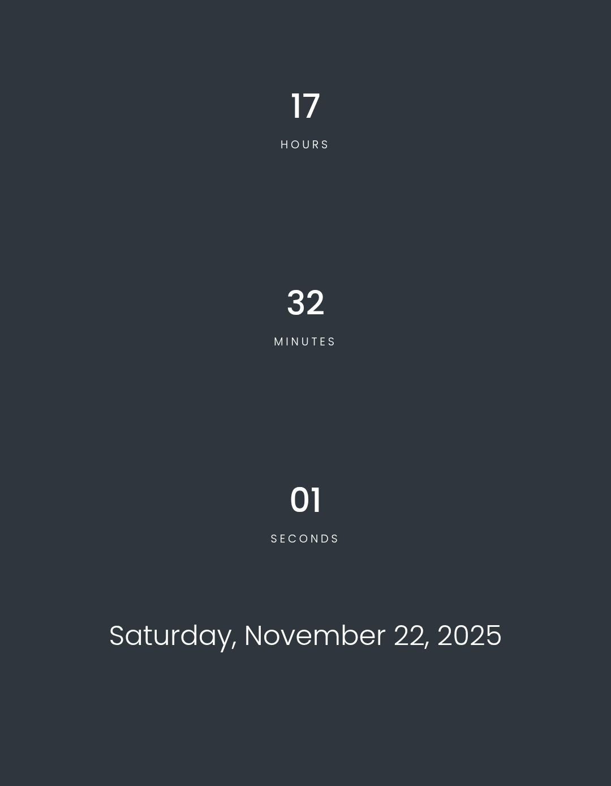

# Digital Clock

A modern, responsive digital clock web application built with pure HTML, CSS, and JavaScript.

**Live Demo:** [https://kamoyaka.github.io/clock/](https://kamoyaka.github.io/clock/)



## Features

- Real-time updating hours, minutes, and seconds
- Full date display (weekday, month, day, year)
- Color-coded circular time units (hours, minutes, seconds)
- Clean and modern dark UI with Poppins font
- Fully responsive design (works on mobile, tablet, and desktop)
- Zero dependencies (except Google Fonts)

## Technologies Used

- **HTML5** – Semantic structure
- **CSS3** – Flexbox layout, media queries, custom properties, responsive design
- **Vanilla JavaScript** – Real-time clock logic using the `Date` object and `setInterval`
- **Google Fonts** – Poppins typeface

No frameworks, libraries, or build tools were used.

## Project Structure

```
clock/
├── index.html      # Main HTML structure
├── styles.css      # All styling and responsive rules
├── script.js       # Clock logic and date formatting
├── clock.jpg       # Project screenshot
└── README.md       # Project documentation
```

## How to Run Locally

1. Clone the repository:
   ```bash
   git clone https://github.com/Kamoyaka/clock.git
   ```
2. Navigate into the project folder:
   ```bash
   cd clock
   ```
3. Open `index.html` in your browser.

That’s it — no installation or build steps required.

## How It Works

- `script.js` creates a new `Date` object every second.
- It extracts hours, minutes, and seconds, then formats them with leading zeros.
- The current date is displayed using `toLocaleDateString()` with a long format.
- CSS uses Flexbox for centering and media queries for responsive sizing of the circular time displays.

## Browser Support

Works on all modern browsers (Chrome, Firefox, Safari, Edge).

## License

This project is open source and available under the [MIT License](LICENSE).

---

Made with ❤️ using pure web technologies.
